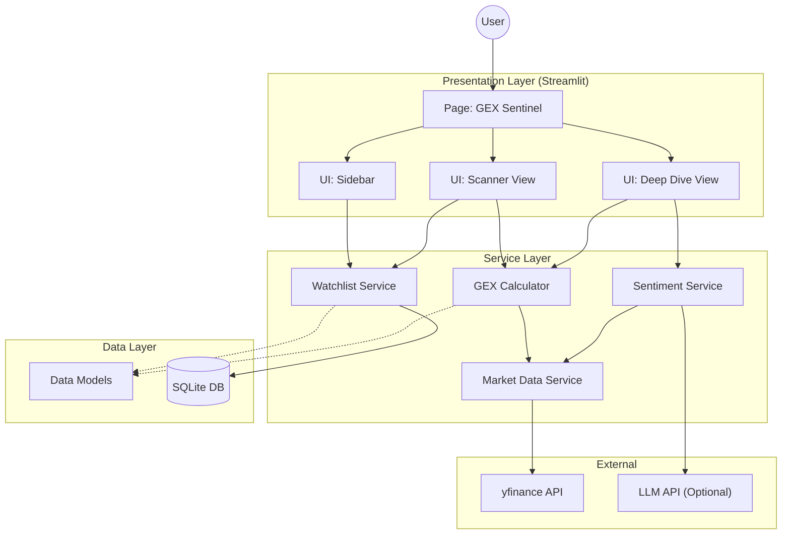

# System Architecture

This document outlines the high-level architecture of the AI Trading Journal application.

## Overview

The application follows a modular Monolithic architecture pattern, designed for a single-user, local-first experience. It leverages **Streamlit** for the frontend and **Python** for the backend logic, utilizing **SQLite** for local persistence.

## Architecture Diagram

## Component Descriptions

### 1. Presentation Layer
- **Page (GEX Sentinel)**: The main entry point for the dashboard.
- **UI Components**: Modularized UI widgets for sidebar controls, scanner tables, and detailed analysis views.

### 2. Service Layer
- **Watchlist Service**: Manages CRUD operations for user-defined watchlists.
- **Market Data Service**: centralized wrapper for `yfinance` with caching strategies to minimize API calls.
- **GEX Calculator**: Core computation engine for Gamma Exposure, Max Pain, and Wall detection.
- **Sentiment Service**: Computes technical indicators and interfaces with LLM for textual analysis.

### 3. Data Layer
- **SQLite DB**: Local file-based database (`trading_journal.db`) storing watchlist configurations.
- **Models**: Pydantic models or Data Classes defining the data structure for type safety.

### 4. External Dependencies
- **yfinance**: Primary source for real-time stock and options data.
- **LLM API**: (Planned) Integration for AI-driven market commentary.

## Data Flow

1.  **Initialization**: App loads, initializes DB connection.
2.  **Watchlist Load**: `WatchlistService` fetches symbols from SQLite.
3.  **Data Fetching**: `MarketDataService` requests market data for symbols (batched/parallel).
4.  **Calculation**: `GEXCalc` processes raw options data into GEX metrics.
5.  **Rendering**: Streamlit UI components render the processed data into tables and charts.
