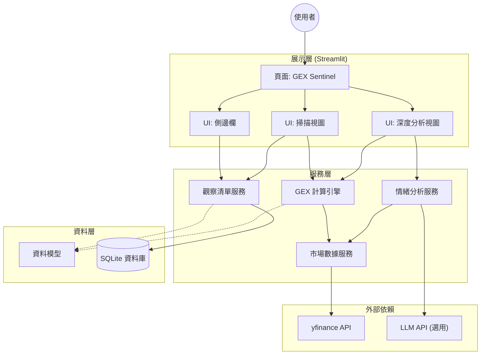

# 系統架構 (System Architecture)

本文件概述 AI Trading Journal 應用程式的高階架構設計。

## 總覽

本應用程式採用模組化的單體架構 (Modular Monolith)，專為單一使用者、本地優先 (Local-First) 的體驗而設計。前端使用 **Streamlit**，後端邏輯以 **Python** 實作，並使用 **SQLite** 進行資料持久化。

## 架構圖

## 組件說明

### 1. 展示層 (Presentation Layer)
- **頁面 (GEX Sentinel)**: 儀表板的主要入口點。
- **UI 組件**: 模組化的 UI 元件，包含側邊欄控制、掃描表格與詳細分析視圖。

### 2. 服務層 (Service Layer)
- **觀察清單服務**: 管理使用者自訂觀察清單的 CRUD 操作。
- **市場數據服務**: `yfinance` 的集中式包裝器，包含快取策略以減少 API 呼叫。
- **GEX 計算引擎**: 負責 Gamma Exposure、最大痛點 (Max Pain) 與牆 (Wall) 偵測的核心運算。
- **情緒分析服務**: 計算技術指標並與 LLM 介接進行文字分析。

### 3. 資料層 (Data Layer)
- **SQLite 資料庫**: 本地檔案式資料庫 (`trading_journal.db`)，儲存觀察清單設定。
- **資料模型**: 使用 Pydantic 模型或 Data Classes 定義資料結構，確保型別安全。

### 4. 外部依賴 (External Dependencies)
- **yfinance**: 即時股票與選擇權數據的主要來源。
- **LLM API**: (規劃中) 用於 AI 市場評論的整合介面。

## 資料流 (Data Flow)

1.  **初始化**: 應用程式啟動，初始化資料庫連線。
2.  **載入清單**: `WatchlistService` 從 SQLite 讀取追蹤代碼。
3.  **數據獲取**: `MarketDataService` 請求市場數據 (批次/平行處理)。
4.  **運算**: `GEXCalc` 將原始選擇權數據轉換為 GEX 指標。
5.  **渲染**: Streamlit UI 組件將處理後的數據繪製成表格與圖表。
